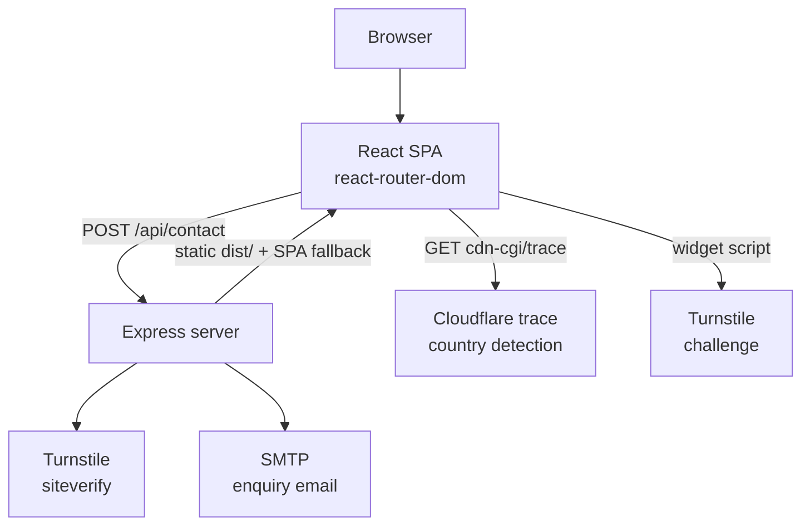

# Silk & Shine Club

Official website for the Silk & Shine Club — an exclusive annual hair care membership by Everlast Wellness Medical Center in Al Bateen, Abu Dhabi. A React single-page application with a small Express API that validates and emails contact enquiries.

| | |
| --- | --- |
| **Production** | https://silkandshineclub.com/ |
| **Frontend** | React 19 · TypeScript · Vite |
| **Backend** | Node.js · Express 4 |
| **Deployment** | Single Node process — Express serves the Vite build and the API (no platform config committed) |
| **Status** | Production |

---

## Overview

The Silk & Shine Club sells an annual membership for clinical hair treatments. The site presents the club, its two gender-specific programmes, and its membership benefits, then routes interested visitors to the contact form.

The site is a marketing and lead-capture front end. There is no database, no user accounts, and no payment processing — the single piece of server-side state is an outbound SMTP connection.

### Main user journey

1. A visitor lands on the home page and reads about the club, its approach, and its member benefits.
2. They open the programme page that applies to them — **For Women** or **For Men** — and read the membership details, benefits, and pricing section.
3. They submit an enquiry through the contact form, which is validated in the browser and again on the server.
4. The server verifies a Cloudflare Turnstile token, re-validates every field, and emails a formatted HTML enquiry to the clinic over SMTP.

The interface is English-only. All content is authored inline in the page and component modules; there is no CMS and no translation layer.

---

## Features

- **Five-page single-page application** — home, two programme pages, about, and contact, with client-side routing
- **Contact form** — full country-code phone selector (233 countries with flag images), inline field validation, loading, success, and error states
- **IP-based country detection** — the phone country selector pre-selects the visitor's country via Cloudflare's trace endpoint, defaulting to the UAE
- **Server-side validation** — the API re-validates every submission independently of the client
- **Cloudflare Turnstile** — CAPTCHA token verified server-side before any other processing
- **HTML escaping** — all user input escaped before interpolation into the enquiry email markup
- **Branded HTML email** — dark-themed, table-based enquiry email with `replyTo` set to the sender
- **Testimonial carousel** — infinite-loop slider with triple-buffered track, dot navigation, and a mobile card-width breakpoint
- **Responsive design** — layouts tuned at 1024px, 900px, 768px, 600px, and 480px, with a dedicated mobile navigation drawer
- **Scroll-aware navigation** — the navbar changes state past 30px of scroll; the mobile drawer locks body scroll while open
- **Scroll restoration** — every route change resets the scroll position to the top
- **CSS animations** — hero background zoom, staggered fade-in-up entrances, and a submit-button spinner
- **SEO metadata** — title, description, keywords, canonical URL, and Open Graph tags in the document head, plus a per-page `document.title`
- **SPA deep-link support** — the Express catch-all returns `index.html` so direct loads and refreshes resolve

---

## Tech Stack

Versions are taken from `package.json` and `server/package.json`.

| Layer | Technology |
| --- | --- |
| Frontend framework | React 19.2 |
| Language | TypeScript ~6.0 |
| Build tool | Vite 8 (`@vitejs/plugin-react` 6) |
| Routing | react-router-dom 7.14 (`BrowserRouter`) |
| Styling | Plain CSS with custom properties — one stylesheet per component |
| Backend | Node.js · Express 4.18 (4.22 resolved) |
| Email | Nodemailer 6.9 (SMTP) |
| CAPTCHA | Cloudflare Turnstile |
| CORS | `cors` 2.8 |
| Config | `dotenv` 16.4 |
| Linting | ESLint 9 · typescript-eslint 8 · eslint-plugin-react-hooks · eslint-plugin-react-refresh |

**External resources loaded from the document head** (`index.html`):

- Google Fonts — Cormorant Garamond (display) and DM Sans (body), with `preconnect` and `display=swap`
- Font Awesome 6.5.1 from cdnjs — every icon in the UI is a Font Awesome class
- Cloudflare Turnstile — `challenges.cloudflare.com/turnstile/v0/api.js`, loaded `async defer`

Country flag images in the phone selector are loaded on demand from `flagcdn.com`.

---

## Architecture

The frontend is a single-page React application built by Vite. The Express server does two things: it exposes one JSON API endpoint plus a health check, and it serves the built frontend with a catch-all fallback so deep links work on refresh. Both run as one process in production.



**Contact form flow.** The client validates the fields locally, checks that a Turnstile token is present, and posts everything to `/api/contact`. The server rejects a missing token first, then verifies the token against Cloudflare, then re-validates the fields, and only then sends the message. Each stage returns its own error, so a rejected submission never reaches the mail transport. On success the client resets the form and calls `turnstile.reset()` so the widget can be used again.

**Country detection.** On mount, the contact page fetches `https://www.cloudflare.com/cdn-cgi/trace` and parses the `loc=` field. If the returned ISO code matches a known country the phone selector switches to it; otherwise the default `AE` (+971) stands. The request is wrapped in a `try/catch` that fails silently.

**Routing.** `BrowserRouter` handles navigation in-process. A `ScrollToTop` component watches `useLocation()` and scrolls to the top on every pathname change. Unmatched paths render the home page component — note this is a soft fallback, not a redirect: the URL is left unchanged and the response is still HTTP 200.

**Static serving.** In production, `express.static` serves `../dist` relative to `server/`, and `app.get('*')` returns `dist/index.html` for anything else. The catch-all is registered after the API routes so it never shadows them. It uses the Express 4 wildcard string — Express 5 rejects that pattern, so the pinned major version matters.

**Development.** Vite's dev server proxies `/api` to `http://localhost:5000` (`vite.config.ts`), so the client and API share one origin during development. The two processes are started separately; there is no combined `dev` script.

> **Port note.** The proxy targets port **5000**, which is `server.js`'s built-in default — but `server/.env.example` sets `PORT=4000`. If you copy the example verbatim the dev proxy will not reach the API. Either drop the `PORT` line or change the proxy target to match.

---

## Project Structure

```
├── index.html                  # App shell: SEO + OG meta, fonts, Font Awesome, Turnstile script
├── package.json                # Frontend deps, scripts, postinstall hook for server/
├── vite.config.ts              # React plugin + dev /api proxy to localhost:5000
├── tsconfig.json               # Project references → app + node configs
├── tsconfig.app.json           # src/ — ES2023, bundler resolution, strict unused checks
├── tsconfig.node.json          # vite.config.ts
├── eslint.config.js            # Flat config: js + typescript-eslint + react-hooks + react-refresh
│
├── public/                     # Served verbatim at the web root
│   ├── favicon.svg
│   └── icons.svg
│
├── server/
│   ├── package.json            # Express, cors, dotenv, nodemailer (CommonJS)
│   ├── server.js               # Entire backend: middleware, /api/contact, /health, static + SPA fallback
│   └── .env.example            # SMTP template — see the warning under Environment Variables
│
└── src/
    ├── main.tsx                # React entry point (StrictMode + createRoot)
    ├── App.tsx                 # BrowserRouter, ScrollToTop, Navbar/Footer shell, route table
    │
    ├── pages/
    │   ├── Home.tsx            # Composes Hero · Features · Services · Membership · Testimonials
    │   ├── ForWomen.tsx        # Women's programme: details, benefits grid, pricing
    │   ├── ForMen.tsx          # Men's programme — same structure, different copy and imagery
    │   ├── About.tsx           # Heritage, stats, story, Everlast Wellness app promo
    │   └── Contact.tsx         # Country data, CountrySelect, validation, Turnstile, submit
    │
    ├── components/
    │   ├── Navbar.tsx          # Scroll state, active link state, mobile drawer, scroll lock
    │   ├── Hero.tsx            # Home hero: badge, title, CTAs, stats panel
    │   ├── Features.tsx        # "Three Pillars" split section
    │   ├── Services.tsx        # Two programme cards linking to /for-women and /for-men
    │   ├── Membership.tsx      # Six-benefit VIP grid
    │   ├── Testimonials.tsx    # Infinite-loop carousel (8 testimonials)
    │   ├── Footer.tsx          # Brand, socials, contact details, working hours
    │   └── Newsletter.tsx      # NOT RENDERED — see Maintenance Notes
    │
    ├── styles/
    │   ├── global.css          # Design tokens, reset, typography, buttons, utilities, keyframes
    │   ├── pages.css           # All page-level styles including the whole contact form (~1100 lines)
    │   ├── Navbar.css · Hero.css · Features.css · Services.css
    │   ├── Membership.css · Testimonials.css · Footer.css
    │   └── Newsletter.css      # Only imported by the unused Newsletter component
    │
    ├── index.css               # UNUSED scaffold leftover — see Maintenance Notes
    ├── App.css                 # UNUSED scaffold leftover
    └── assets/imgs/            # WebP photography, logo, favicon
```

Two things are worth understanding before making changes:

**There is no CSS manifest.** Each component imports its own stylesheet directly; `global.css` is imported once in `App.tsx`. Cascade order therefore follows React's import graph rather than a single ordered file. Put new rules in the stylesheet matching the component, and shared tokens or utilities in `global.css`.

**`src/pages/Contact.tsx` is by far the largest module** (679 lines). Most of it is the static `rawCountries` table and the `CountrySelect` component; the form logic itself sits at the bottom of the file.

---

## Routes

Defined in [src/App.tsx](src/App.tsx). All routes render inside a shared `Navbar` / `Footer` layout.

| Path | Page component | Purpose |
| --- | --- | --- |
| `/` | `Home` | Hero, approach, programme overview, membership benefits, testimonials |
| `/for-women` | `ForWomen` | Women's programme, benefits grid, pricing section |
| `/for-men` | `ForMen` | Men's programme, benefits grid, pricing section |
| `/about` | `About` | Club heritage, statistics, story, Everlast Wellness app promo |
| `/contact` | `Contact` | Enquiry form, clinic contact details, social links |
| `*` | `Home` | Unrecognised paths render the home page without changing the URL |

**Page titles.** There is no head-management library. Each page sets `document.title` in a `useEffect` on mount:

| Route | Title |
| --- | --- |
| `/` | `Silk & Shine Club — Ultimate Hair Care Membership \| Abu Dhabi` |
| `/for-women` | `For Women — Silk & Shine Club Hair Membership` |
| `/for-men` | `For Men — Silk & Shine Club Hair Membership` |
| `/about` | `About — Silk & Shine Club by Everlast Wellness` |
| `/contact` | `Contact Us — Silk & Shine Club` |

Because titles are only set on mount, the `*` fallback keeps whatever title was set previously until `Home` mounts.

**Outbound links.** The programme pages link to the Everlast Wellness store (`https://everlastwellness.store/product-category/hair-care/`); the about page links to the Everlast Wellness apps on the App Store and Google Play; the footer and contact page link to five Everlast Wellness social profiles. All open in a new tab with `rel="noopener noreferrer"`. The footer's *Privacy Policy* and *Terms of Service* links are `href="#"` placeholders.

---

## Internationalization

**Not implemented.** The site is English-only: `<html lang="en">`, `og:locale` is `en_AE`, and all copy is hardcoded in the component modules. There is no translation layer, no locale registry, no language switcher, and no RTL support.

Adding a language would mean extracting the inline copy from every page and component into a locale module first — a substantial refactor, not a configuration change.

---

## API

The backend is a single file, [server/server.js](server/server.js). Two endpoints are exposed; everything else falls through to static file serving.

CORS is restricted to `POST` and to three origins: `http://localhost:5173` (Vite dev), `http://localhost:4173` (Vite preview), and `https://silkandshineclub.com`.

### POST `/api/contact`

Submits a membership enquiry and emails it to the clinic.

**Request body**

```json
{
  "name": "Full name",
  "phone": "+971 500000000",
  "email": "person@example.com",
  "message": "Enquiry text, at least ten characters.",
  "turnstileToken": "<token from the Turnstile widget>"
}
```

The client composes `phone` by joining the selected country's dial code and the typed number with a space; the server stores whatever string it receives.

**Success — `200`**

```json
{ "success": true, "message": "Email sent successfully." }
```

**Validation or CAPTCHA failure — `400`**

```json
{ "success": false, "errors": ["Invalid email.", "Message too short."] }
```

**Mail transport failure — `500`**

```json
{ "success": false, "error": "Failed to send email. Please try again." }
```

Note the two error shapes differ: `400` responses carry an `errors` array, `500` responses carry a single `error` string. The client currently only branches on `res.ok`, so it shows one generic failure message for either.

**Processing order**

1. **Missing token** → `400` with `["Security check is required."]`
2. **Turnstile verification** against `https://challenges.cloudflare.com/turnstile/v0/siteverify`, sending the secret, the token, and `req.ip`. Any non-success result or a thrown network error → `400` with `["Security check failed. Please try again."]`
3. **Field validation** — all failures collected and returned together as `400`
4. **Send** via Nodemailer; SMTP errors are logged server-side and returned as a generic `500`

**Server-side validation rules**

| Field | Rule |
| --- | --- |
| `name` | String, trimmed length ≥ 2 |
| `phone` | String, trimmed length ≥ 5 |
| `email` | String matching `/^[^\s@]+@[^\s@]+\.[^\s@]+$/` |
| `message` | String, trimmed length ≥ 10 |

The client rules in `Contact.tsx` are stricter in one respect — the phone number must match `/^\d{6,15}$/` after whitespace is stripped, before the dial code is prepended.

**Email.** Sent from `"Silk & Shine Club" <EMAIL_USER>` to `EMAIL_TO` (falling back to `customer.service@everlastwellness.com`), with `replyTo` set to the submitter's address and the subject `New Contact Form Submission — <name>`. Both a plain-text and an HTML part are sent. Every interpolated field passes through `escapeHtml()`, which escapes `&`, `<`, `>`, `"`, and `'`.

### GET `/health`

Liveness check. Note the path is `/health`, **not** `/api/health`, so it is not reachable through the Vite dev proxy.

```json
{ "status": "ok" }
```

---

## Environment Variables

No secret values belong in the repository. `.env` and `server/.env` are both gitignored. The frontend reads **no** environment variables at all — there are no `VITE_`-prefixed variables and no `import.meta.env` usage anywhere in `src/`.

### Server

Read by `dotenv` from `server/.env`. None are safe to expose to the client.

| Variable | Required | Purpose |
| --- | --- | --- |
| `EMAIL_HOST` | Yes | SMTP server hostname |
| `EMAIL_PORT` | No | SMTP port. Defaults to `587` |
| `EMAIL_USER` | Yes | SMTP username; also the `From` address on enquiry emails |
| `EMAIL_PASS` | Yes | SMTP password or app password |
| `EMAIL_TO` | No | Recipient address. Falls back to `customer.service@everlastwellness.com` |
| `TURNSTILE_SECRET_KEY` | Yes | Cloudflare Turnstile **secret** key, used for server-side verification |
| `PORT` | No | HTTP port. Defaults to `5000` |

> **`server/.env.example` is out of date.** It documents `SMTP_HOST`, `SMTP_PORT`, `SMTP_SECURE`, `SMTP_USER`, `SMTP_PASS`, and `RECIPIENT_EMAIL`, none of which `server.js` reads. It also omits `TURNSTILE_SECRET_KEY` entirely and sets `PORT=4000` against a code default and dev proxy of `5000`. Use the table above, not the example file.

Two further notes:

- **`EMAIL_SECURE` is not read.** The transporter hardcodes `secure: false`, so implicit TLS on port 465 is not currently supported — use STARTTLS on 587.
- **No startup credential check.** Missing variables are not validated at boot. Nodemailer's `transporter.verify()` runs at startup and logs `SMTP connection error: …` on failure, but the server still starts and the endpoint still accepts submissions, returning a `500` per request.

### Turnstile site key

The Turnstile **site** key is hardcoded in [src/pages/Contact.tsx](src/pages/Contact.tsx#L413) as `0x4AAAAAAASx--In2l1QKgmD`, not read from the environment. This is a public key by design and safe to commit, but changing it requires a code edit and a rebuild. The matching secret key must be supplied through `TURNSTILE_SECRET_KEY`.

---

## Local Development

**Prerequisites:** Node.js with npm. The build targets ES2023; a current LTS release is expected.

**1. Clone and install**

Dependencies live in two manifests. The root `postinstall` script installs the server's dependencies automatically, so one command covers both.

```bash
git clone https://github.com/youssefkaramev/silk-and-shine-club.git
cd silk-and-shine-club
npm install
```

**2. Configure the server environment**

Create `server/.env` — do not copy `.env.example`, which uses stale variable names:

```bash
EMAIL_HOST=smtp.example.com
EMAIL_PORT=587
EMAIL_USER=your-smtp-user
EMAIL_PASS=your-smtp-password
EMAIL_TO=recipient@example.com
TURNSTILE_SECRET_KEY=your-turnstile-secret-key
PORT=5000
```

The file is gitignored. The site runs without it, but the contact form will not deliver mail.

**3. Start both processes**

There is no combined dev script — run them in two terminals.

```bash
# Terminal 1 — API on http://localhost:5000
npm start
# or, with file watching:
npm --prefix server run dev

# Terminal 2 — Vite dev server on http://localhost:5173
npm run dev
```

Keep the API on port `5000`; that is what `vite.config.ts` proxies `/api` to.

**4. Verify the setup**

The server prints `✓ SMTP connected and ready` at startup when the credentials work. Confirm it directly:

```bash
curl http://localhost:5000/health
```

**Turnstile on localhost.** The widget only renders on hostnames registered for the site key. Add `localhost` to the widget's allowed hostnames in the Cloudflare dashboard, or the form will block on the security check locally.

---

## Available Scripts

Root `package.json`:

| Command | Description |
| --- | --- |
| `npm run dev` | Start the Vite dev server (frontend only) |
| `npm run build` | Type-check with `tsc -b`, then build to `dist/` |
| `npm run preview` | Serve the production build locally on port 4173 |
| `npm run lint` | Run ESLint across the repository |
| `npm start` | Start the Express server (`node server/server.js`) |
| `npm run postinstall` | Runs automatically after `npm install` — installs `server/` dependencies |

`server/package.json`:

| Command | Description |
| --- | --- |
| `npm start` | Run the API on its own from within `server/` |
| `npm run dev` | Same, with `node --watch` for automatic restarts |

Type checking runs as part of `npm run build`. To check types without building, run `npx tsc -b`. Note that `tsconfig.app.json` enables `noUnusedLocals` and `noUnusedParameters`, so unused imports fail the build rather than merely warning.

> **`npm run lint` does not currently pass.** It reports three errors and one warning against the committed code, all pre-existing: `react-hooks/set-state-in-effect` in `Navbar.tsx` (line 18) and `Testimonials.tsx` (line 83), `prefer-const` on `newReal` in `Testimonials.tsx` (line 95), and a `react-hooks/exhaustive-deps` warning for a missing `total` dependency. `npm run build` is unaffected and succeeds. Expect a non-zero exit from lint until these are addressed — do not treat it as a regression from your own changes.

---

## Production / Deployment

**No deployment configuration is committed.** There is no `railway.toml`, `vercel.json`, `netlify.toml`, `Dockerfile`, `Procfile`, or GitHub Actions workflow in the repository. The deployment target is not recorded in source and must be confirmed with the project owner.

The package scripts nonetheless describe an unambiguous single-process model, and the live site is served at `https://silkandshineclub.com/`:

```bash
npm install    # postinstall also installs server/ dependencies
npm run build  # type-check, then emit the static frontend to dist/
npm start      # node server/server.js — serves dist/ and mounts the API
```

**Install.** The root `postinstall` hook runs `cd server && npm install`, so both dependency trees are installed by a single `npm install`. If a host runs `npm ci` instead, confirm the hook still fires — the server has no `node_modules` of its own otherwise, and the process will fail to boot.

**Build.** `npm run build` runs `tsc -b` before `vite build`; a type error fails the deployment.

**Start.** `npm start` launches Express, which serves `dist/` as static files, mounts `POST /api/contact` and `GET /health`, and returns `dist/index.html` from the catch-all for every other path — so `/for-women`, `/about`, and every other deep link resolve on direct load and refresh.

**Required configuration in the hosting environment:**

- All server variables from the table above, `TURNSTILE_SECRET_KEY` included.
- `PORT`, if the platform assigns one — the code honours `process.env.PORT` and falls back to `5000`.
- `https://silkandshineclub.com` is already in the CORS allowlist. Serving the site from any other origin requires editing the array in `server.js`.
- The production domain must be registered with Cloudflare Turnstile for the hardcoded site key, or the widget will refuse to render.

**Email asset note.** The enquiry email embeds a logo by absolute URL: `https://silkandshineclub.com/assets/white-logo-BC1mp1lb.webp`. That filename contains a Vite content hash, so it changes whenever `white-logo.webp` is modified — after which the logo in every email 404s until the URL in `server.js` is updated.

---

## Security

Mechanisms actually implemented in this codebase:

- **Secrets in environment variables** — no credentials in source; `.env` and `server/.env` are gitignored
- **SMTP credentials server-side only** — the mail transport is never reachable from the browser
- **Cloudflare Turnstile** — the token is verified server-side against Cloudflare before validation or delivery, and the client's own token check is only a convenience
- **Server-side validation** — the API validates every submission independently of the client
- **HTML escaping** — all user-supplied fields pass through `escapeHtml()` before interpolation into the email markup
- **CORS allowlist** — three explicit origins, restricted to the `POST` method
- **Safe external links** — every `target="_blank"` anchor carries `rel="noopener noreferrer"`
- **Generic error responses** — SMTP failures are logged server-side and returned to the client as an unspecific message

For clarity, the following are **not** implemented: authentication, authorization, rate limiting, CSRF protection, request-size limits beyond Express's `express.json()` default (100kb), security headers such as Helmet or a Content Security Policy, and any startup validation of email credentials. The site has no user accounts, sessions, or authenticated areas, so there is nothing for an auth layer to guard. Turnstile is the only abuse control on the contact endpoint — there is no per-IP throttle behind it.

---

## Performance & UX

- **WebP imagery throughout** — all photography in `src/assets/imgs/` is WebP, bundled and content-hashed by Vite
- **Lazy-loaded images** — every below-the-fold image carries `loading="lazy"`; the hero background is a CSS background image loaded eagerly
- **Font preconnect** — `fonts.googleapis.com` and `fonts.gstatic.com` are preconnected in the head, and the font request uses `display=swap`
- **Deferred Turnstile script** — loaded `async defer`; the contact page polls for `window.turnstile` every 100ms and clears the interval once the widget renders
- **Widget cleanup** — the Turnstile widget is removed on unmount and reset after a successful submission
- **Passive scroll listener** — the navbar's scroll handler is registered with `{ passive: true }`
- **Transform-only carousel** — the testimonial track animates `transform`, staying off the layout path; the transition is disabled during the loop snap so the reset is invisible
- **Body scroll lock** — opening the mobile drawer sets `overflow: hidden` on `<body>` and restores it on close and unmount
- **Scroll restoration** — route changes scroll to the top with `behavior: 'instant'`, avoiding a smooth-scroll animation on navigation
- **Client-side routing** — page transitions require no network round-trip

No caching layer, service worker, or code splitting is implemented — the SPA ships as a single Vite bundle, and `React.lazy` is not used.

---

## Design System

Design tokens live at the top of [src/styles/global.css](src/styles/global.css) as CSS custom properties on `:root`. Prefer a token over a literal value.

**Palette** — a deep teal-black theme. Backgrounds run `--bg-primary` `#060E0B` through `--bg-secondary`, `--bg-card`, and `--bg-card-hover`. The brand accent is a teal extracted from the logo, exposed as `--gold` `#2C9E8A` with `--gold-light`, `--gold-dark`, `--gold-alpha`, and `--gold-border` variants. Text uses `--text-primary`, `--text-secondary`, and `--text-muted`.

> The accent variables are named `--gold` for historical reasons but hold teal values. Rename with care — the names are used across every stylesheet.

**Typography** — `--font-heading` is Cormorant Garamond (Georgia serif fallback) for all headings; `--font-body` is DM Sans (system-ui fallback) for body copy. Section titles use `clamp(2rem, 4vw, 3.2rem)` and the hero title `clamp(3rem, 6vw, 5rem)`, so display type scales fluidly without breakpoints.

**Scales** — radii `--radius-sm` 6px through `--radius-xl` 32px; shadows `--shadow-gold` and `--shadow-card`; transitions `--transition` (0.3s) and `--transition-slow` (0.6s), both on `cubic-bezier(0.4, 0, 0.2, 1)`. Layout is bounded by `--max-width` 1500px with `--section-padding` of `80px 0`, dropping to `50px 0` below 768px.

**Shared classes** — `.container`, `.section`, `.section-label` (uppercase eyebrow with a leading rule), `.section-title`, `.section-subtitle`, `.btn-primary` (teal gradient), `.btn-outline`, `.divider`, and `.gold-rule`.

**Animations** — `global.css` defines `fadeInUp`, `fadeIn`, `shimmer`, and `float`. `Hero.css` adds `bgZoom` (a 20s background scale-down) and `dotPulse`, and staggers hero element entrances with animation delays. `pages.css` defines `spin` for the submit spinner.

**Responsive approach** — a desktop-first cascade. Breakpoints in use, by frequency: 1024px, 900px, 768px, 767px, 600px, and 480px, with one-off rules at 1550px, 1415px, 1032px, 640px, and 560px. The navigation collapses to the mobile drawer at **900px**; the testimonial carousel switches its card width from 380px to 280px at **640px**, measured in JavaScript via a `resize` listener rather than a media query.

---

## Maintenance Notes

| Task | Where |
| --- | --- |
| Add a page | Create it in `src/pages/`, then add a `<Route>` in the `Routes` block of `src/App.tsx` |
| Add a navigation link | `src/components/Navbar.tsx` — the desktop links, the gender links, and the mobile drawer are three separate blocks |
| Add a footer link | `src/components/Footer.tsx` |
| Change page copy | Directly in the page or component module — all content is inline JSX or a local array at the top of the file |
| Change home page sections | `src/pages/Home.tsx` composes the section components in order |
| Change the accent colour | `--gold*` variables in `src/styles/global.css` |
| Add styles | The stylesheet matching the component; shared tokens and utilities in `global.css` |
| Change validation rules | Client: `validate()` in `src/pages/Contact.tsx`. Server: `validateContact()` in `server/server.js`. Change both — they are independent |
| Change email content or styling | The `mailOptions` object in `server/server.js` |
| Add an API endpoint | `server/server.js`, registered **before** the `app.get('*')` catch-all |
| Update the Turnstile site key | Hardcoded in `src/pages/Contact.tsx`; the secret goes in `server/.env` |
| Add or remove a country code | The `rawCountries` array in `src/pages/Contact.tsx` |

**Known dead code.** Three files are present but unreachable, all leftovers from the Vite scaffold and an earlier design direction:

- `src/index.css` and `src/App.css` are not imported anywhere. `index.css` still carries an entirely different purple-and-gold light/dark palette that has nothing to do with the current theme.
- `src/components/Newsletter.tsx` (and its `Newsletter.css`) is fully implemented but never rendered by any page. Its submit handler only sets local state — there is no newsletter backend, so wiring it up would require a new endpoint.

**`.glass-panel` is applied but unstyled.** The class is used on more than a dozen elements across the hero, service cards, membership benefits, about stats, and pricing sections, but its only definition lives in the unimported `src/index.css`. It currently contributes nothing at runtime. Either move the rule into `global.css` — where its `var(--bg-glass)` and `var(--border-light)` references will need retargeting to the teal tokens — or remove the class.

**Duplicate programme pages.** `ForWomen.tsx` and `ForMen.tsx` differ only in imagery, headings, and three copy strings; their `membershipDetails` and `benefits` arrays are byte-identical. A change to the shared content must be made in both files.

**Footer copyright** is hardcoded to `© 2024` in `src/components/Footer.tsx`, while the enquiry email uses `new Date().getFullYear()`.

**The favicon declaration is inconsistent.** `index.html` points at `src/assets/imgs/favicon.png` with `type="image/svg+xml"` and a root-relative-less path, while `public/favicon.svg` and `public/icons.svg` — the two files that *are* served verbatim at the web root — are referenced nowhere. Pointing the link at `/favicon.svg` would be the straightforward fix.

---

## Troubleshooting

**`/api/contact` 404s or fails in development**
The Express server is not running, or it is not on port `5000`. `npm run dev` starts Vite only. Start the API with `npm start`, and check that `PORT` in `server/.env` matches the proxy target in `vite.config.ts`.

**The Turnstile widget never appears**
Either the CDN script was blocked — the page polls indefinitely for `window.turnstile` — or the hostname is not registered for the site key. On localhost, add `localhost` to the widget's allowed hostnames in the Cloudflare dashboard.

**The form always reports "Security check failed"**
`TURNSTILE_SECRET_KEY` is missing from `server/.env` or does not match the site key hardcoded in `Contact.tsx`. Verification also returns failure when the fetch to Cloudflare throws, so check the server's outbound network access.

**Enquiries never arrive but the form reports success**
The form only reports success on a `200`, so this points at delivery rather than the endpoint — check the recipient's spam folder and the `EMAIL_TO` value. If mail is failing outright, the server logs `Nodemailer error: …` and the client shows the generic failure message instead.

**`SMTP connection error` at startup**
`transporter.verify()` failed. Check `EMAIL_HOST`, `EMAIL_PORT`, `EMAIL_USER`, and `EMAIL_PASS`. Gmail requires an app password, not the account password. Note that `secure` is hardcoded `false`, so port 465 (implicit TLS) will not connect — use 587.

**Copying `server/.env.example` produces a non-working server**
Expected. The example file uses stale `SMTP_*` and `RECIPIENT_EMAIL` names that `server.js` does not read, omits `TURNSTILE_SECRET_KEY`, and sets a conflicting port. Use the Environment Variables table instead.

**The logo is broken in enquiry emails**
The email references a content-hashed asset URL. Rebuilding after any change to `white-logo.webp` produces a new hash; update the `` in `server/server.js` to match the filename emitted in `dist/assets/`.

**Deep links 404 in production**
The SPA fallback is not being reached. Confirm `npm run build` ran and `dist/` exists next to `server/`, and that `server/node_modules` was installed — the catch-all uses Express 4 wildcard syntax, which Express 5 rejects.

**`npm run build` fails on an unused variable**
`noUnusedLocals` and `noUnusedParameters` are enabled in `tsconfig.app.json`. Remove the unused binding; the dev server does not enforce this, so it surfaces only at build time.

---

## License

No license is currently specified for this repository. All rights reserved by the project owner.
